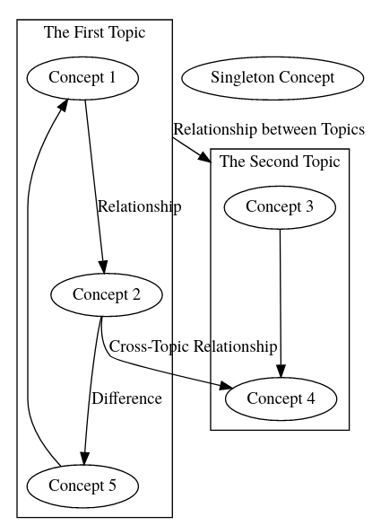
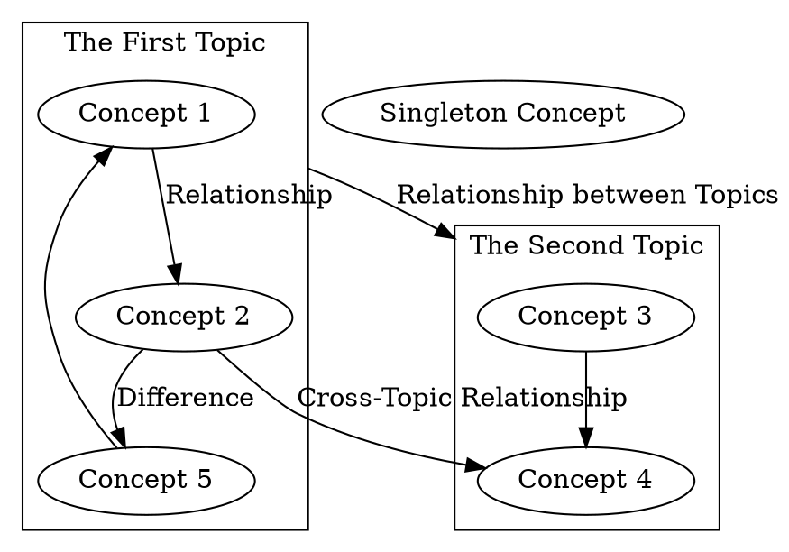

# Knowledge Graph
## What do I need to install?
1. Install `pandoc` following https://github.com/jgm/pandoc/blob/master/INSTALL.md
1. Install `graphviz` via
    ```bash
    sudo apt install graphviz
    ```
## How do I open the graph?
Simply open `graph.html` using your browser. In terminal, this can be done by
```bash
browse graph.html
```
## I would like to build my own knowledge graph!
The `graphviz` code for generating the graph is located at `graph.dot`.
To build your own graph, edit this file using your favorate editor, e.g., vim.
```bash
vim graph.dot
```

We use the following knowledge graph as a running example.



The self-explained code for generating this graph is attached below.
Note that the `subgrah` identifier must start with `cluster`.
In orther words, `subgraph topic_1 {}` does not work.


