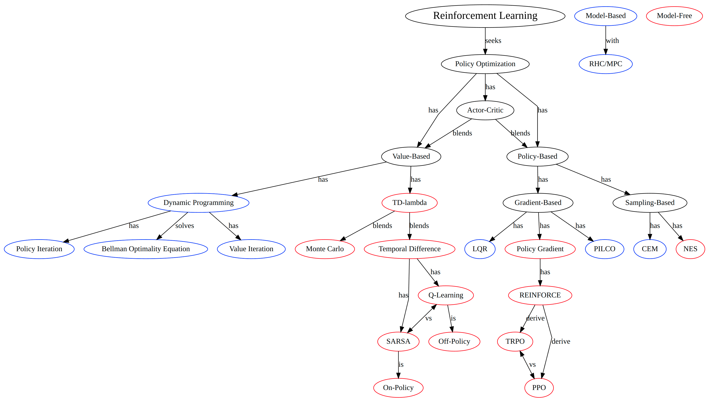

# Share Your Expertise with the World: Online Knowledge Graph! 📖

Welcome to the online interactive knowledge graph! Click on the image below to check out the Reinforcement Learning graph in action. Note that the text in the graph is also clickable, so you can easily navigate to different topics.

[](https://weizhechen.com/KnowledgeGraph/index.html)

> It is important to note that the Reinforcement Learning graph was created for demonstration purposes and may not be entirely accurate due to the limited time (several hours) available for its construction.

## Make Your Own Graph!🙋

To create your own knowledge graph, follow these steps:

1. Install [Pandoc](https://github.com/jgm/pandoc/blob/master/INSTALL.md) - a universal document converter that we use to convert the Markdown files to HTML.
2. Install [Graphviz](https://graphviz.org/) - an open-source graph visualization software that we use to generate the graph. To install Graphviz on Ubuntu, use the following command:

    ```bash
    sudo apt install graphviz
    ```

3. Clone this repository:

    ```bash
    git clone https://github.com/Weizhe-Chen/KnowledgeGraph.git
    ```

4. Add a new Markdown file explaining a concept (e.g., `concept_a.md`) or a relationship (e.g., `from_a_to_b.md`). Use the following format for the file:
    ```Markdown
    ---
    title: "Concept A"
    ---
    Describe your understanding of this concept or its relationship with other concepts.
    ```
5. Add the concept or relationship to the graph. Modify `index.dot` using your favorite text editor.
    * To add a concept:
        ```dot
        "Concept A" [href="./html/concept_a.html"];
        ```
    * To add a relationship:
        ```dot
        // we can also make the edge label clickable by adding href attribute.
        "Concept A" -> "Concept B" [label="is"]
        ```
6. Build the graph.
    ```bash
    make
    ```
7. Open the graph. Simply open the generated `index.html` file or you can use the `open.sh` script to open the graph in your default browser:
    ```bash
    ./open.sh
    ```
8. If you would like to share your knowledge graph online, like [this website](https://weizhechen.com/KnowledgeGraph/index.html), follow these steps:
    * Fork this repository via the upper-right button.
    * Go to your forked repository.
    * Find the *Settings* option on the top
    * Select **Pages** in the left panel.
    * Select **main** in the **Branch** section and save it to enable your GitHub Pages.
    * Enable **Enforce HTTPS**.
    * Now your knowledge graph can be accessed via `https://your-github-user-name.github.io/KnowledgeGraph/index.html`.

## Acknowledgements 👏

We would like to thank the following tools and resources for making this project possible:

* [Pandoc](https://pandoc.org/) - for converting the Markdown files to HTML.
* [Graphviz](https://graphviz.org/) - for generating the graph.
* [ChatGPT](https://chat.openai.com/) - for helping us build the demo reinforcement learning knowledge graph.
