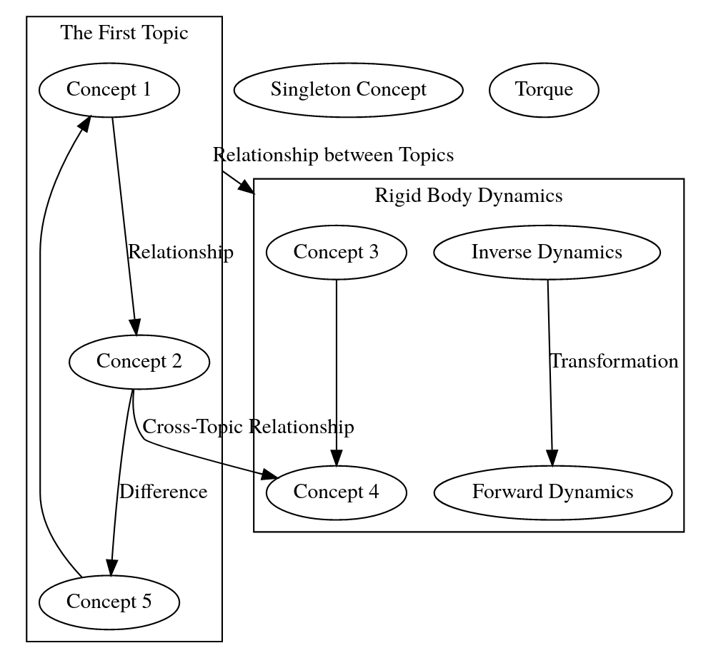

# Knowledge Graph
Click on the image to check out the interactive knowledge graph.

<p align="center"><a href="https://htmlpreview.github.io/?https://github.com/Weizhe-Chen/KnowledgeGraph/blob/main/graph.html"></a></p> 

## What should I install?
1. Install `pandoc` following https://github.com/jgm/pandoc/blob/master/INSTALL.md
1. Install `graphviz` via

    ```bash
    sudo apt install graphviz
    ```

## How do I open the graph?
Simply open `graph.html` using your browser. In terminal, this can be done by

```bash
browse graph.html
```

## I would like to build my own knowledge graph!
The `graphviz` code for generating the graph is located at `graph.dot`.
To build your own graph, edit this file using your favorate editor, e.g., vim.

```bash
vim graph.dot
```

The demo knowledge graph is generated by the following self-explained code.
Note that the `subgrah` identifier must start with `cluster`.
In orther words, `subgraph topic_1 {}` does not work.


